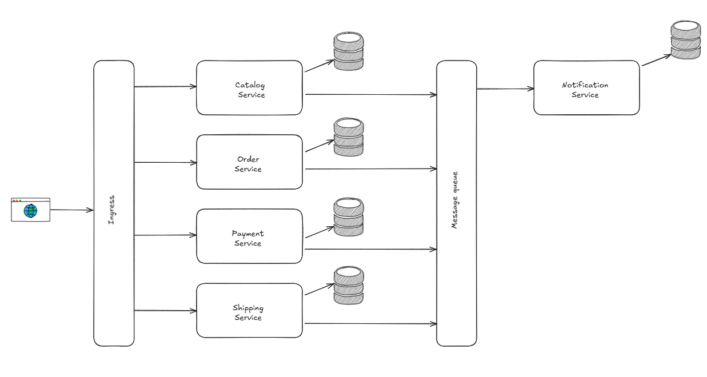

# E-Commerce-Microservices
The project consists of some C# microservices, each responsible for a specific domain of the e-commerce platform.

## Microservices

### Catalog Service

**Responsibilities:** Manages product catalog, including adding new products, updating product details, and listing products.

### Order Service

**Responsibilities:** Manages order creation, order status updates, and order history.

### Payment Service

**Responsibilities:** Processes payments, handles payment status updates, and manages payment methods.

### Shipping Service

**Responsibilities:** Manages shipping options, shipping status updates, and tracking information.

### Notification Service

**Responsibilities:** Sends notifications (email, SMS, push notifications) related to user actions, order status changes, etc.

## Technologies and Tools

- **.NET 8, C#:** For implementing microservices.

- **Entity Framework:** For data access and ORM.

- **Swagger:** For API documentation.
  
- **RabbitMQ:** For message queuing and inter-service communication.

- **Postgres and MongoDB:** For data storage.

- **Prometheus and OpenTelemetry:** For metrics.

- **Tempo and OpenTelemetry:** For tracing.

- **Loki, Promtail and Serilog:** For log aggregation.

- **Grafana:** For visualization of metrics, logs and traces. 

- **Docker:** To containerize the microservices for easy deployment.

- **Kubernetes:** For orchestrating the deployment of microservices.

- **Helm:** For managing Kubernetes applications.

- **Nginx Ingress:** For managing external access to the services.

- **Linkerd:** For service mesh and observability.
